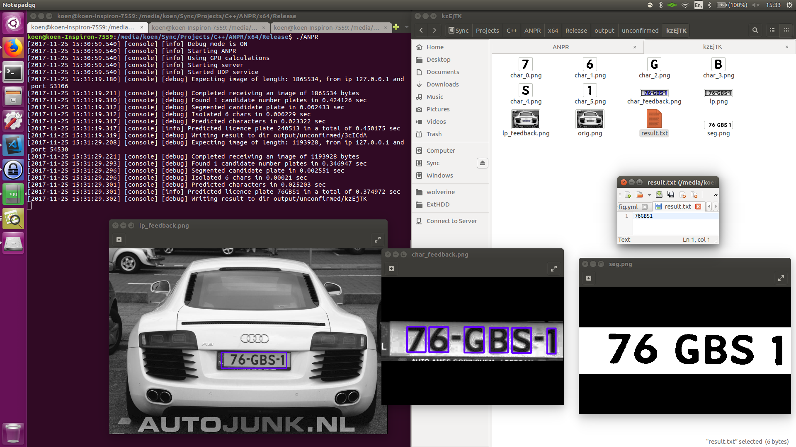

# ANPR-Server-C++
A multithreaded Automatic Number Plate Recognition (ANPR) server written in C++, much like [OpenALPR](https://github.com/openalpr/openalpr).

A few features
- Communication with a client source (webcam/security cam/image/video) happens over UDP instead of TCP
 - This provides us with much faster processing & lower latency (e.g. ~2-3 ms instead of 100 ms delay on a local network)
 - Some example scripts how to provide data to this server are in my ANPR-Client-Python repository
- Program is completely multi-threaded (frame based) and scales up to hundreds of cores.
- Uses Deep Neural Networks (DNNs) for
 - Segmentation: masking & isolating characters in a licence plate image
 - Classification: classification of characters in a licence plate, e.g. say that an image contains a '7'
- Uses Histogram of Gradients (HoG) descriptors for licence plate detection

TODOs
- Use DNNs for licence plate localization
- Write sequence id format for the UDP server for the case packets arrive out of order, those frames are dropped now

# Usage
If you use 64-bit windows you can use the precompiled binary, if not you'll have to compile manually.
Dependencies are:
- C++17 capable compiler
- OpenCV >3.3.x (or earlier version, with a manually linked opencv-DNN module, from opencv-contrib)
- SFML >2.x

Just run the executable, and supply data through udp.
Examples how to do this can be found [here](https://github.com/srslynow/ANPR-Server-Python).
See the files:
- socket_send_udp.py
- socket_send_udp_video.py

General UDP structure uses the format:
- Initial packet is 4 bytes (int) indicating frame data size, endian format is dependend on ANPR-Server host. Most systems use Little-endian, as does mine.
- Following packets contain JPG-encoded frame data, keep packet size <1500 bytes to prevent fragmentation
- Repeat for more frames.. :)

The server keeps track of ip & port of the data-sending client, it assumes non-concurrent data sending.
You have a few options to use multiple cameras:
- Interleave the frames from different cameras
- Set up different socket for the different senders, this will give the new client a different sending port, thus enabling the server to differentiate between clients.

